# Projeto: Deploy de WordPress em AWS com Docker

## Objetivo
Desenvolver e aprimorar habilidades em **Linux, AWS e automação de processos** por meio da configuração de um ambiente de servidor web monitorado.

## 📌 Etapas do Projeto

1. **Instalação e Configuração**
   - Configurar **Docker** ou **Containerd** no host EC2.
   - Preferencialmente utilizar **user_data.sh** para instalação automatizada no Start Instance.
   
2. **Arquitetura e Topologia**
   - Seguir a topologia definida para o ambiente.

3. **Deploy da Aplicação WordPress**
   - Criar um container para a aplicação.
   - Utilizar **RDS MySQL** como banco de dados.
   - Configurar **EFS AWS** para armazenamento de arquivos estáticos do WordPress.

4. **Configuração do Load Balancer**
   - Implementar um **Load Balancer AWS** para distribuir o tráfego da aplicação.

    ### Topologia:
    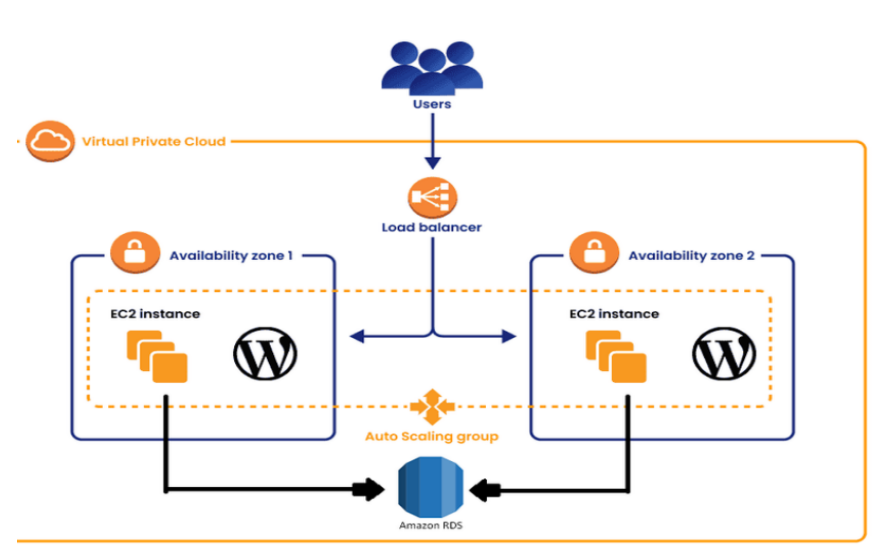   

## 🔹 Tecnologias Utilizadas
- Amazon Web Services (AWS) 
- WSL (Windows Subsystem for Linux)
- Gitbash
- Docker
- Nginx

## 🛠️ Configuração do Ambiente

### 1. Criação de uma VPC
1. Acesse o AWS Management Console.
3. Clique em Create VPC.
4. Escolha do nome para a VPC.
5. Clique em "VPC e muito mais" e defina dessa forma:
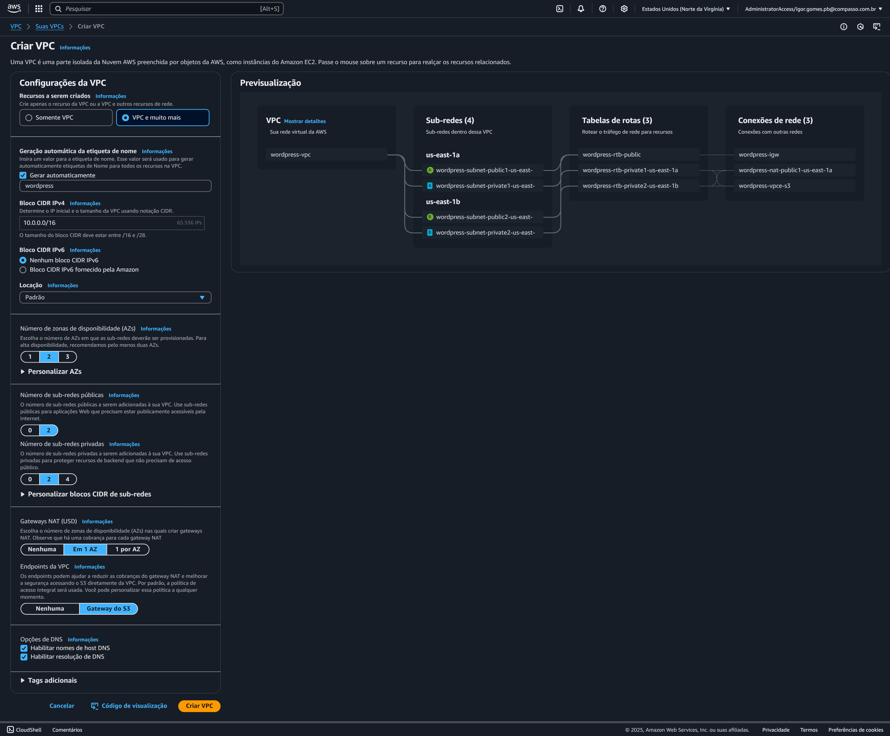
8. Clique em Create VPC.  
<br>  
  
### 2. Criação de um Security Group:
#### No console EC2 acesse "Security" Groups e crie com as seguintes regras:

| Nome | Regra de Entrada | Regra de Saida |
|------|------------------|----------------|
| SG-WP-EC2 | HTTP - TCP - 80 - (SG-CLB) | MYSQL/Aurora - TCP - 3306 - (SG-RDS)<br>NFS - TCP - 2049 - (SG-EFS)<br>HTTP - TCP - 80 - (SG-CLB)<br>Todo o tráfego - Tudo - Tudo - 0.0.0.0/0 |
| SG-WP-LB | HTTP - TCP- 80- 0.0.0.0/0 - Todo trafego | HTTP - TCP - 80 - (SG-EC2) |
| SG-WP-EFS | NFS - TCP - 2049 - (SG-EC2) | NFS - TCP - 2049 - (SG-EC2) |
| SG-WP-RDS | MYSQL/Aurora - TCP - 3306 - (SG-EC2) | MYSQL/Aurora - TCP - 3306 - (SG-EC2) 
#### O console ficara assim:
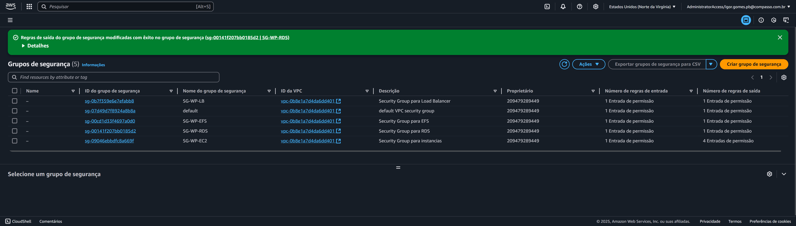

### 3. Criação de um Banco de Dados
1. Vá para o console "Aurora and RDS" e selecione "Criar um banco de dados".
2. Selecione as informações:
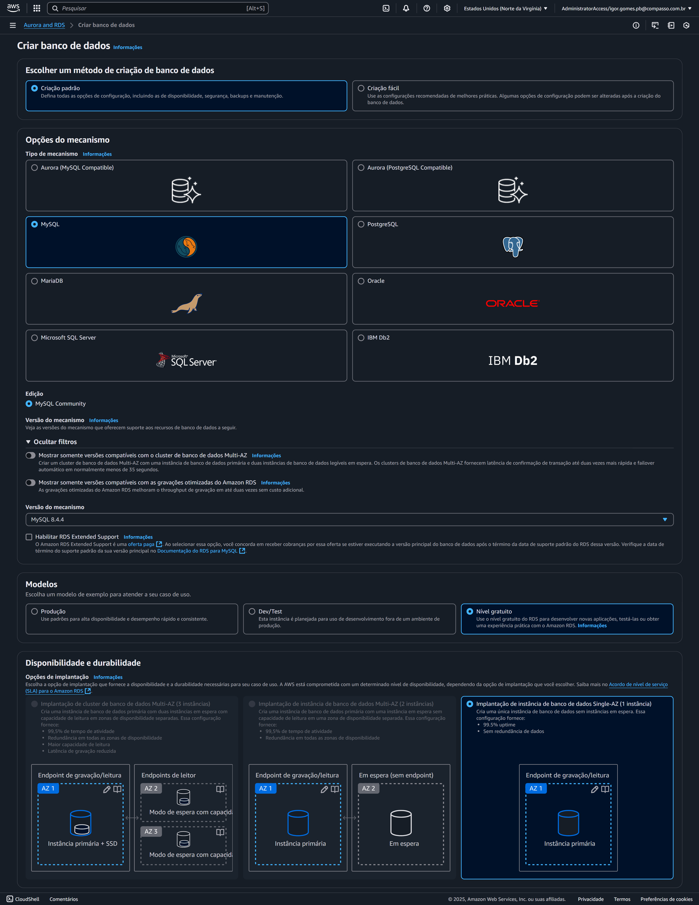
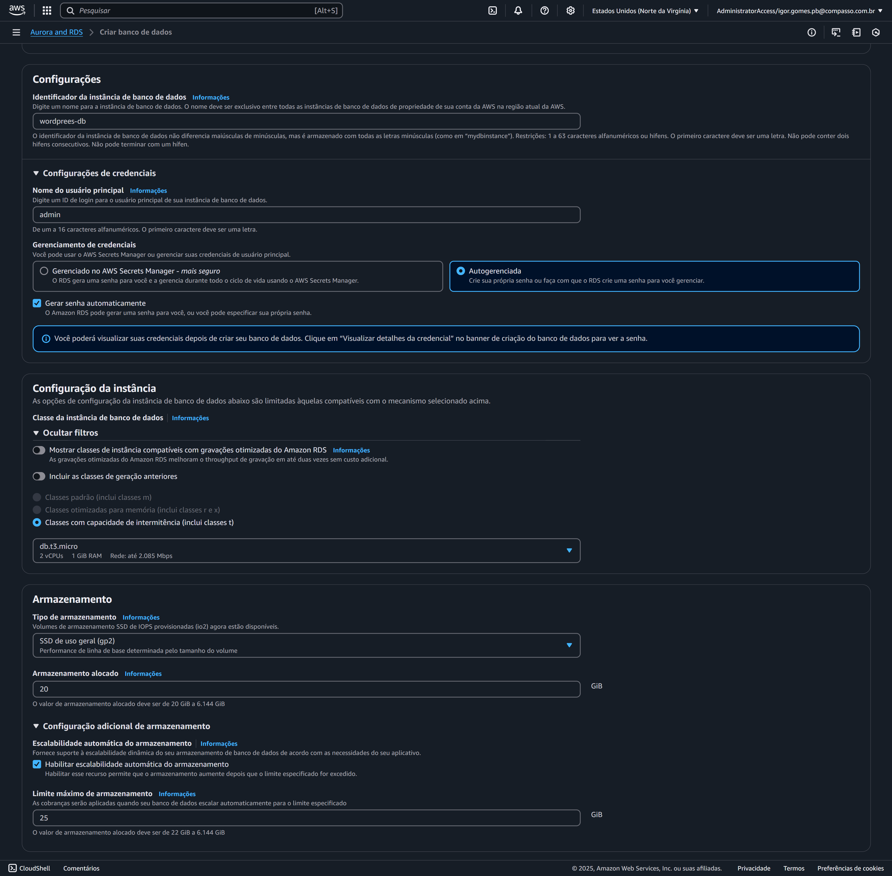
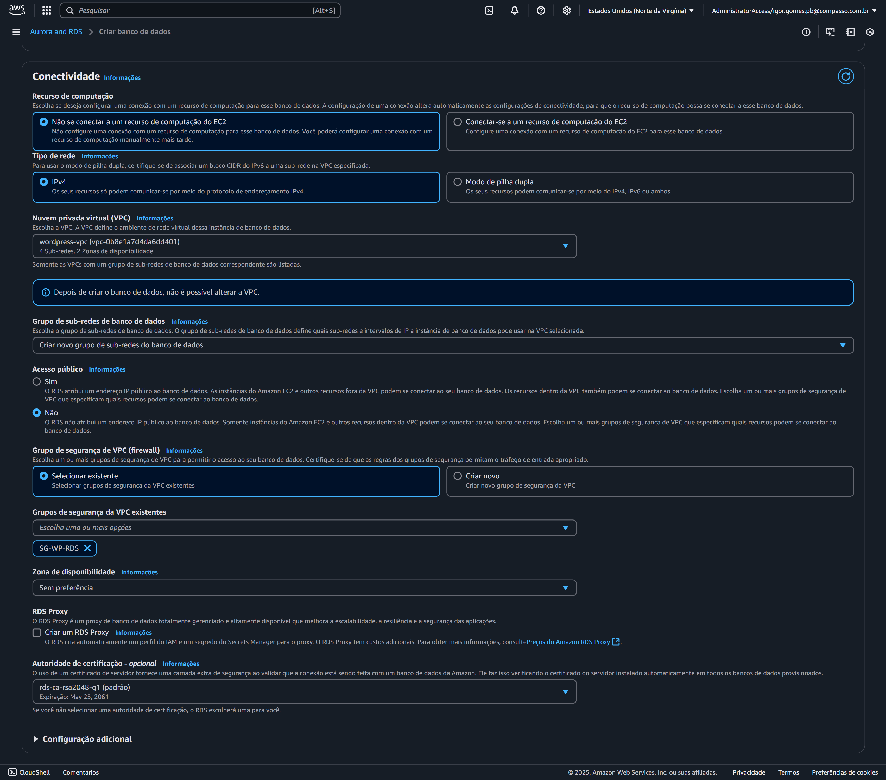
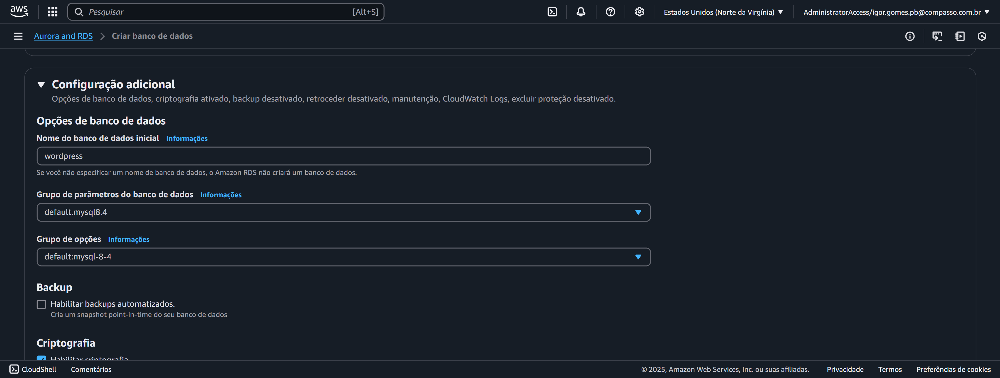
3. Depois de confirmar, crie o banco e espere.
4. Após a criação salve em um arquivo txt o endpoint do seu banco e senha gerada.

### 4. Criação de um EFS
1. Vá para o "Elastic File system" e selecione "Criar sistema de arquivos"
2. Insira um nome e selecione a VPC criada
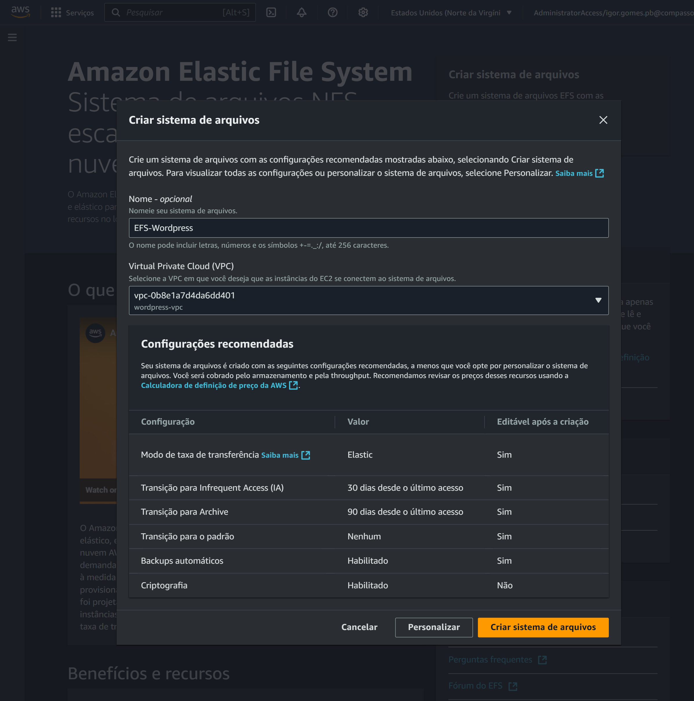
3. Com o EFS criado acesse-o e navegue até Rede > Gerenciar
4. Com a VPC do projeto selecionada selecione nos destinos de montagem os grupos de segurança criados para o EFS e salve
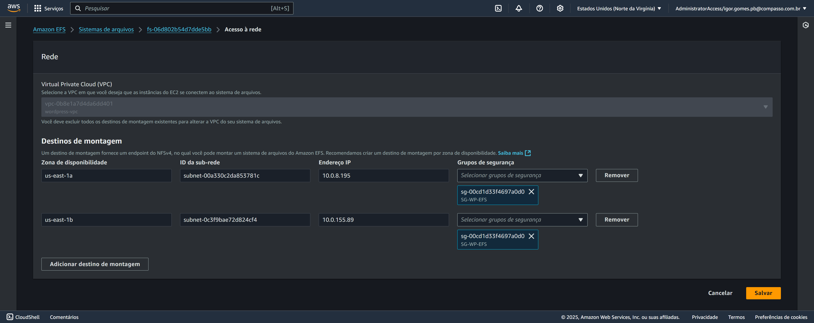
5. Com os destinos de montagem pronto, na pagina do EFS clique em anexar
6. Copie e salve. 
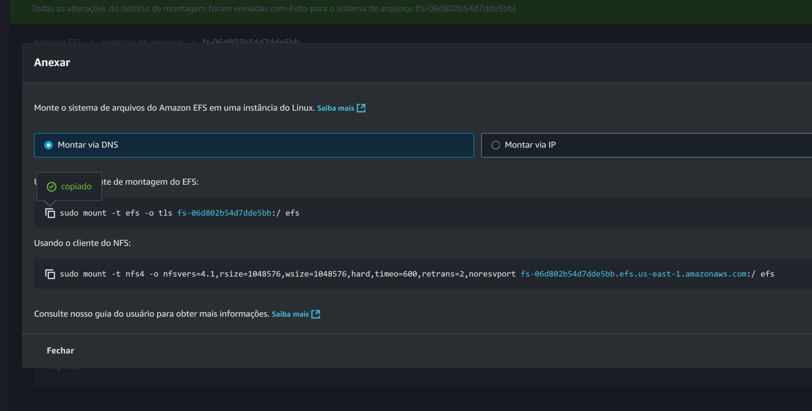
  
### 5. Criação do Classic Load Balancer
1. Vá para EC2 > Load Balancers e clique em "Criar Load Balancer"
2. Selecione o tipo Clássico
3. Nomeie
4. Selecione "Voltado para a internet"
5. Selecione a VPC do projeto e as 2 sub-redes publicas
6. Selecione o Security Group do Load Balancer
7. Nas verificações de integridade troque o caminho para /wp-admin/install.php
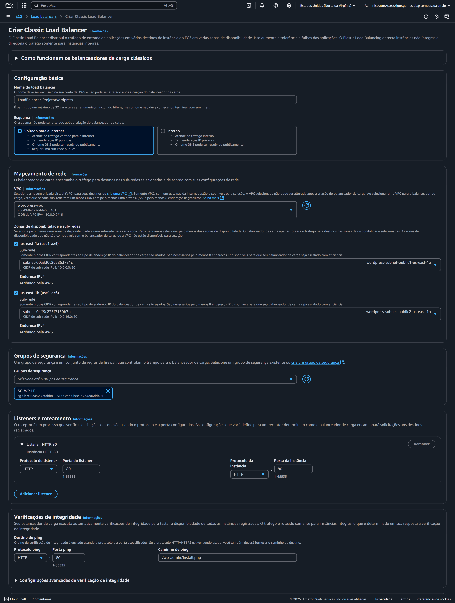
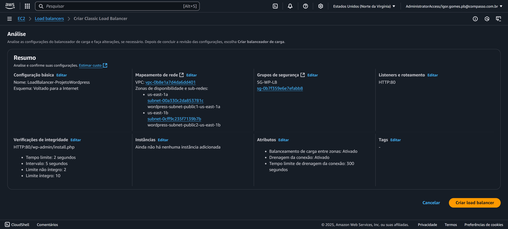

### 6. Criação do docker-compose
1. Crie um repositório no Github
2. Dentro do repositorio, crie os arquivos: docker-compose.yml e script-user-data.txt
#### docker-compose:
````
services:
  wordpress:
    image: wordpress:latest
    container_name: wordpress
    restart: always
    ports:
      - "80:80"
    environment:
      WORDPRESS_DB_HOST: <ENDPOINT-DO-RDS>:3306
      WORDPRESS_DB_USER: admin
      WORDPRESS_DB_PASSWORD: <SENHA-DO-RDS>
      WORDPRESS_DB_NAME: wordpress
    volumes:
      - /data:/var/www/html
````
3. Insira a sua senha e endpoint no seu arquivo
#### UserData:
````
#!/bin/bash

# Atualiza os pacotes do sistema
yum update -y

# Instala pacotes necessários
yum install -y ca-certificates wget amazon-efs-utils

# Instala o Docker
yum install -y docker

# Inicia e habilita o serviço do Docker
systemctl enable docker
systemctl start docker

# Adiciona o usuário ec2-user ao grupo docker para evitar uso de sudo
usermod -aG docker ec2 -user

# Instala o Docker Compose
curl -L "https://github.com/docker/compose/releases/latest/download/docker-compose-$(uname -s)-$(uname -m)" -o /usr/local/bin/docker-compose
chmod +x /usr/local/bin/docker-compose
ln -s /usr/local/bin/docker-compose /usr/bin/docker-compose

# Cria o diretório de montagem do EFS
mkdir -p /data

# Monta o sistema de arquivos EFS
<COMANDO DE MONTAGEM DO EFS> /data


#Pega o docker compose do github
wget -O /home/ec2-user/docker-compose.yml <LINK RAW DO SEU DOCKER COMPOSE NO GITHUB>
sudo chown ec2-user:ec2-user /home/ec2-user/docker-compose.yml

# Ajusta permissões do arquivo
chown ec2-user:ec2-user /home/ec2-user/docker-compose.yml

# Inicia os containers com Docker Compose
cd /home/ec2-user && docker-compose up -d
````
4. Insira o comando de montagem do EFS e o link raw do seu docker compose

### 7. Criação do  Launch Template
1. Vá para EC2 > Modelos de Execução e clique em Criar modelo de execução
2. Insira um nome e selecione o campo "Orientação sobre o Auto Scaling"
3. Insira as informações como na imagem:
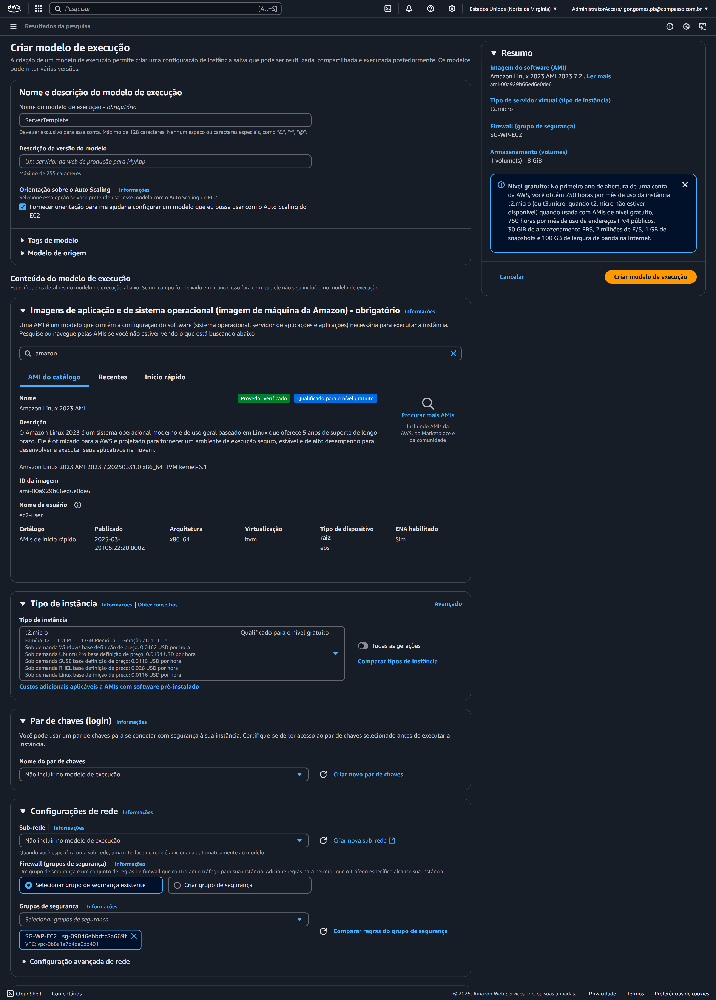   
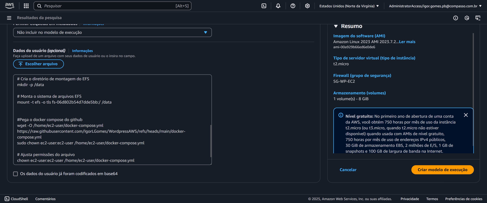   


### 8. Criação do Auto Scaling Group
1. Vá até o console da EC2, acesse a seção Grupos de Auto Scaling e clique em Criar grupo de Auto Scaling.
2. Insira um nome para o Auto Scaling Group
3. Selecione o modelo da execução como "latest"
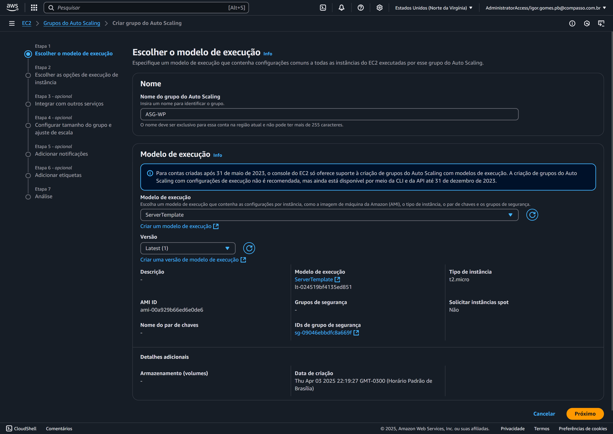   
4. Escolha a VPC do seu projeto e marque as duas sub-redes privadas. Deixe selecionada a opção padrão de balanceamento "Melhor esforço equilibrado".
5. Associe o Auto Scaling Group ao Load Balancer Clássico configurado anteriormente para este ambiente.
6. Ative também a verificação de integridade (health check) do ELB.
7. Defina a escala de instâncias conforme desejado. Para testes, recomenda-se:
- Capacidade desejada: 2
- Mínima: 2
- Máxima: 4
8. Habilite a coleta de métricas do grupo no Amazon CloudWatch, para monitoramento detalhado.
1. 1Ignore a etapa 5 (Regras de escalabilidade, neste momento não é necessário).
1. Revise todas as configurações feitas e finalize clicando em Criar Auto Scaling Group.

### Configurando um Alarme no CloudWatch para CPU
 Crie um alarme no Amazon CloudWatch para acompanhar o uso da CPU e disparar ações automáticas quando um limite pré-estabelecido for alcançado.

 A métrica que será acompanhada é a CPU Utilization, vinculada ao Auto Scaling Group, já que ele gerencia dinamicamente as instâncias EC2 responsáveis por manter o desempenho do ambiente.

1. Clique em Selecionar Métrica.

1. Escolha a categoria EC2.

1. Dentro dela, opte por monitorar a métrica via Auto Scaling Group.

1. Selecione a opção referente ao uso da CPU (CPU Utilization).

1. Defina o limite: neste caso, se a utilização da CPU for igual ou superior a 95%, uma nova instância deverá ser iniciada.

1. Remova qualquer ação padrão associada.

1. Em seguida, selecione Criar nova ação de Auto Scaling e utilize a política configurada anteriormente na etapa 7.11.

Com isso, o alarme estará ativo e, assim que o uso de CPU ultrapassar o limite estabelecido, o sistema escalará automaticamente, garantindo maior performance e disponibilidade para sua aplicação.
### Acessando via DNS
1. Acesse o console da EC2, vá até a seção Load Balancers e clique sobre o Load Balancer já existente.
1. Em seguida, copie o campo DNS Name exibido nas informações detalhadas e cole no seu navegador para acessar a aplicação.
Após a instalação essa deve ser a tela apresentada
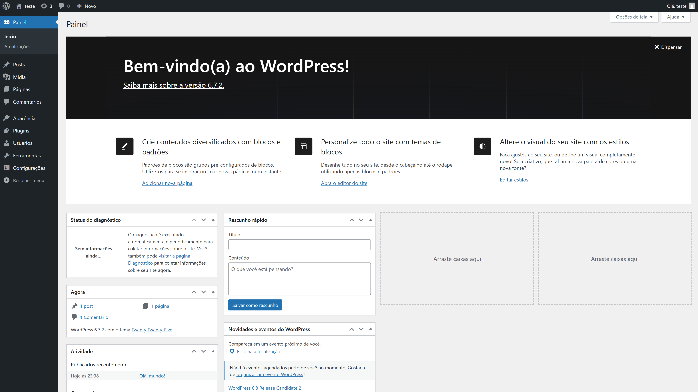 
